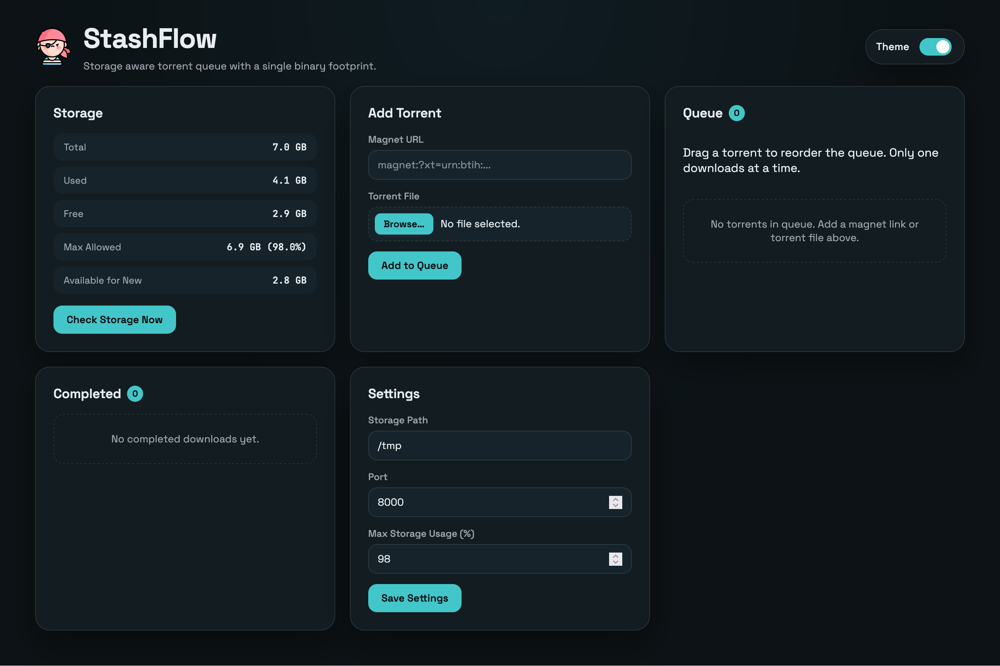

# StashFlow [](https://github.com/pyprism/StashFlow/actions/workflows/run-tests.yaml) [](https://codecov.io/gh/pyprism/StashFlow)

<div style="text-align:center;"></div>

StashFlow is a lightweight, storage aware torrent client  with a single binary deployment.

## Why StashFlow exists ?
I run an SBC with 8 GB of RAM, using `tmpfs` as storage for torrent downloads. The problem is that I can't start torrents
whenever I want there simply isn’t always enough space available. Traditional torrent clients also don’t automatically 
resume queued downloads once storage becomes free. Because of that, downloads require constant manual monitoring.

So I built StashFlow to solve this.

## Screenshot

<div style="text-align:center;"></div>

## Quick Start

1. Build: `go build -o stashflow ./cmd/stashflow`
2. Run: `./stashflow start`
3. Open: `http://localhost:<port>`

## Development

Run without compiling:

- `go run ./cmd/stashflow start`

This uses the same config/state paths as the built binary.

### Using Makefile

The project includes a Makefile for common development tasks:

```bash
make test          # Run all tests
make test-cover    # Run tests with coverage
make coverage-html # Generate HTML coverage report
make test-bench    # Run benchmarks
make build         # Build the binary
make build-arm64   # Build for ARM64
make lint          # Run go vet and go fmt
make clean         # Clean build artifacts
make help          # Show all available targets
```

## Testing

Run unit tests:

```bash
# Run all tests
go test ./...

# Run tests with verbose output
go test -v ./...

# Run tests with coverage
go test -cover ./...

# Generate HTML coverage report
go test -coverprofile=coverage.out ./...
go tool cover -html=coverage.out -o coverage.html

# Run benchmark tests
go test -bench=. -benchmem ./...

# Run benchmarks for specific package
go test -bench=. -benchmem ./internal/storage
```

## CLI Commands

- `stashflow start` starts the service and prompts for storage path + port interactively, saves config then daemonize.
- `stashflow stop` sends SIGTERM, waits up to 6s for exit, cleans up PID file.
- `stashflow status` prints PID, storage path, port, and queue counts.
- `stashflow start -f` starts the service in the foreground (no demonization) for debugging.

## Storage and Queue State

Configuration and state are stored in user config directory:

- macOS: `~/Library/Application Support/stashflow/`
- Linux: `~/.config/stashflow/`

Files:

- `config.json` stores settings like storage path and port.
- `state.json` stores the queue items and ordering.
- `torrents/` stores uploaded .torrent files for persistence.
- `stashflow.log` contains logs of service basic activity.

## Notes

- Changing storage path or port from the web UI requires restarting the service.
- StashFlow limits total usage to 90% of the configured storage location.

### Icon credit: <a href="https://www.flaticon.com/free-icon/pirate_6208182" title="pirate icons">Pirate icons created by Freepik - Flaticon</a>
